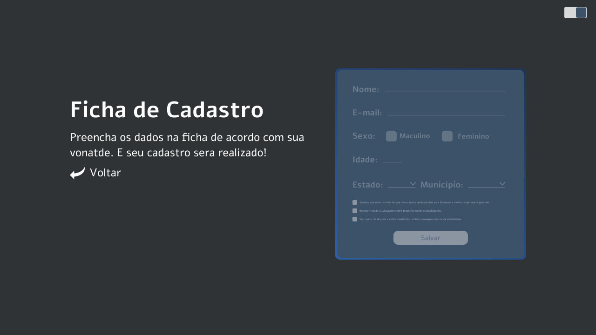
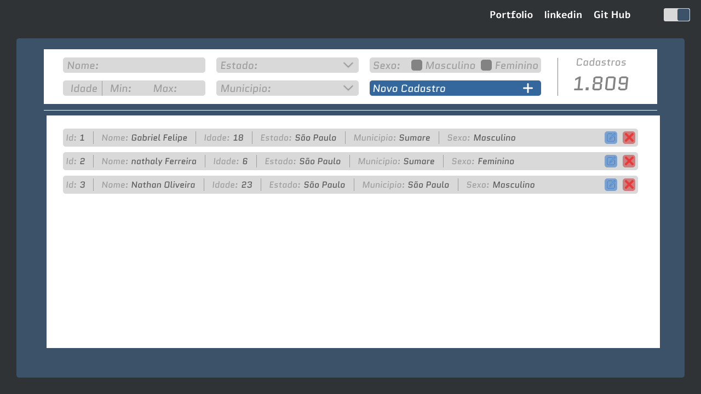

# Lista Register

[Link do Projeto](https://ferreirointz.github.io/List_Register)

[Imagens ilustrativas do Projeto]
---

Este e um projeto *antigo*. Havia feito ele para treinar minhas habilidades com o React. Ele se enquadra mais como um FrameWork simples, pois nao tem muita aplicacao real, sendo necessario conectar ele a um Banco.

Uma *particularidade* dele e que ele tem uma *API* do *_ibge_*. Assim, quando voce seleciona um estado na pagina de cadastro, ele pega as cidades do estado selecionado.
